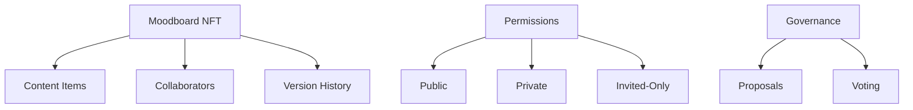

# SparkTide Creative Collaboration

SparkTide is a decentralized platform that enables artists and designers to create, share, and collaborate on digital moodboards as NFTs. The platform provides a transparent system for creative inspiration sharing while maintaining creator rights and fostering community engagement.

## Overview

SparkTide allows creators to:
- Create and own digital moodboards as NFTs
- Collect and organize creative inspiration (images, colors, textures, etc.)
- Set collaboration permissions and manage contributors
- Track version history of moodboards
- Participate in platform governance
- Optionally monetize their creations

## Architecture

The platform is built on the Stacks blockchain using a primary smart contract that manages moodboards, collaborations, and governance.



### Core Components:
- **Moodboards**: Unique NFTs containing creative content
- **Collaborators**: Users with specific permissions for each moodboard
- **Content Items**: Digital assets within moodboards
- **Version History**: Tracking changes and evolution of moodboards
- **Governance System**: Platform-wide decision making through proposals and voting

## Contract Documentation

### sparktide-core.clar

The main contract managing all platform functionality.

#### Key Features:

1. **Moodboard Management**
   - Creation and ownership of moodboards
   - Metadata management
   - Content addition and removal
   - Version tracking

2. **Collaboration System**
   - Permission management (view, edit, invite)
   - Collaborator administration
   - Access control enforcement

3. **Governance**
   - Proposal creation and management
   - Voting system
   - Result tracking

## Getting Started

### Prerequisites
- Clarinet
- Stacks wallet
- Node.js development environment

### Basic Usage

1. Create a new moodboard:
```clarity
(contract-call? .sparktide-core create-moodboard 
    "My Design Inspiration" 
    "A collection of minimalist design elements" 
    u1)
```

2. Add a collaborator:
```clarity
(contract-call? .sparktide-core add-collaborator 
    moodboard-id 
    collaborator-principal 
    true  ;; can-view
    true  ;; can-edit
    false ;; can-invite
)
```

3. Add content:
```clarity
(contract-call? .sparktide-core add-content 
    moodboard-id 
    u1  ;; CONTENT-TYPE-IMAGE
    "https://example.com/image.jpg"
    "{\"description\": \"Inspiration piece\"}")
```

## Function Reference

### Moodboard Functions

```clarity
(create-moodboard (title (string-ascii 100)) 
                 (description (string-utf8 500)) 
                 (permission-type uint))
```
Creates a new moodboard NFT.

```clarity
(update-moodboard (moodboard-id uint)
                 (title (string-ascii 100))
                 (description (string-utf8 500))
                 (permission-type uint))
```
Updates existing moodboard metadata.

### Collaboration Functions

```clarity
(add-collaborator (moodboard-id uint)
                 (collaborator principal)
                 (can-view bool)
                 (can-edit bool)
                 (can-invite bool))
```
Adds a collaborator with specified permissions.

### Content Management

```clarity
(add-content (moodboard-id uint)
            (content-type uint)
            (content-url (string-ascii 255))
            (metadata (string-utf8 500)))
```
Adds new content to a moodboard.

## Development

### Testing
Run contract tests using Clarinet:
```bash
clarinet test
```

### Local Development
1. Start Clarinet console:
```bash
clarinet console
```

2. Deploy contract:
```bash
clarinet deploy
```

## Security Considerations

### Permission Management
- Always verify creator and collaborator permissions before operations
- Respect permission hierarchy (creator > collaborator)
- Validate all permission changes

### Content Safety
- Content URLs should be validated off-chain
- Metadata should be sanitized before storage
- Version history provides accountability

### Known Limitations
- Content storage is reference-only (URLs)
- Permissions are basic (view/edit/invite)
- No content encryption
- Governance implementation is basic

### Best Practices
- Always check return values for errors
- Verify permissions before attempting operations
- Use version tracking for significant changes
- Test collaboration features thoroughly